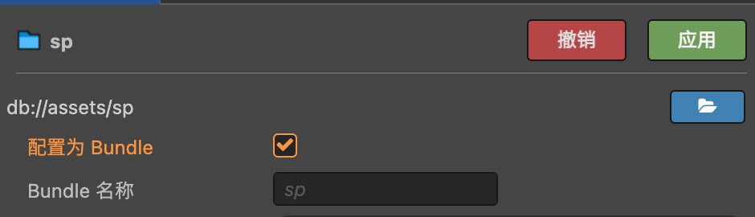

# 手动安装

:::caution 提示

手动安装需要掌握一定的 [Git](https://git-scm.com/doc) 和 [自定义引擎](https://docs.cocos.com/creator/2.4/manual/zh/advanced-topics/engine-customization.html) 知识，推荐使用我们发布的 [引擎扩展](./installation-engine-plugin) 一键安装。

:::

## 引擎要求

**请将 Cocos Creator 至少升级到 v2.4.x 版本，服务包不保证对 v2.4 版本以下的兼容性。**

**强烈推荐直接升级到最新引擎版本**，官方只会对 2.x 版本只会进行维护性更新，所以不用担心其稳定性问题。

**并且每次服务包的更新只会发布引擎最新版本的压缩包。**

## 标准安装

当你的项目所使用的引擎版本与服务包适配的引擎版本一致，并且自己未对引擎有任何改动时，可参考以下步骤安装：

### 1.替换自定义引擎

压缩包内的 `engine` `cocos2d-x` `jsb-adapter` 这三个目录分别就是我们已经修改好的 **JavaScript 引擎**、**Cocos2d-x 引擎** 和 **jsb-adpater**。

参照官方的 [自定义引擎](https://docs.cocos.com/creator/2.4/manual/zh/advanced-topics/engine-customization.html) 文档分别配置或替换这三个部分即可。

:::tip 提示

**官方文档中的一些步骤我们已经帮你做好了**：

**定制 JavaScript 引擎：**参考官方文档的 `1.2 修改 JS 引擎路径` 设置路径即可，无需安装编译依赖或者编译。

**定制 Cocos2d-x 引擎：**

**替换 jsb-adapter：**这一步只需要替换目录即可，但请一定不要忘记！

并且如果你的项目**不需要支持原生平台，可以只定制 JavaScript 引擎**，无需定制 Cocos2d-x 和 jsb-adapter。
:::

### 2.往项目放入资源

由于我们无法为引擎新增内置资源，所以需要你手动操作这一步，将压缩包内 `project` 目录的 `sp` 目录拷贝到项目的 `assets` 目录中，并设置 `sp` 目录为 **Asset Bundle**。

:::caution 注意

请勿随意放置，路径必须是 `assets/sp`，在编辑器环境中引擎只能通过路径读取资源。

请勿随意修改 Asset Bundle 的名称，名称必须是 `sp`，在实际运行中会通过加载这个 Asset Bundle 读取资源。

没有必要将这个 Asset Bundle 设为远程包或者 Zip 压缩，里面只是两个 Effect 着色器资源。

:::

### 3.TypeScript 类型提示（可选）

如果你的项目使用 TypeScript，请将压缩包内 `project` 目录的 `creator-sp.d.ts` 拷贝到项目根目录中，更新引擎 API 接口类型提示。

部分 IDE 可能需要重启才会生效。

## 补丁安装

如果你无法升级到引擎的最新版本，或者本身已对引擎有过修改，我们提供 Git Patch 让你能在已有修改的基础上应用我们对引擎的改动。

接下来我们不会说的很细致，你需要有一定的动手能力。

在压缩包内的 `patch` 目录放着最新的 Git Patch 文件，在引擎目录应用补丁就等同于应用了我们对引擎的所有改动，这时候你就可以按照官方的自定义引擎文档去使用了。

Git Patch 存储了我们所有的提交信息，所以你可以只挑选你想要的改动进行应用。

如果你使用的不是引擎最新版本，你依然可以将 Git Patch 应用在 2.4.x 版本的引擎上进行适配，可能会发生冲突或者不兼容的情况，不过差别应该不是很大，可以自行完成适配工作。

完成自定义引擎的工作后，请别忘了还要将资源放入项目哦（可参考标准安装的[第 2、3 步](#2往项目放入资源)进行操作）。

## 下载链接

### Service Pack v1.0 

适配 **Cocos Creator v2.4.9** 版本，请确认你项目的引擎版本一致。

[下载压缩包](http://www.baidu.com)

### 历史版本

[存档页面](test)
