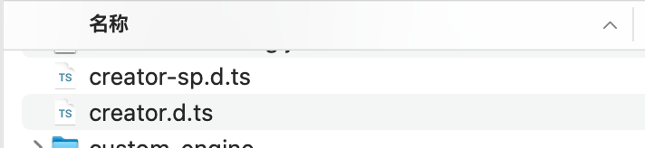
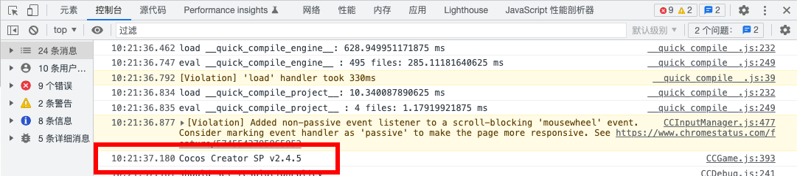

# 手动安装

## Service Pack v1.0.0

适配 Cocos Creator v2.4.9 版本，[点此下载服务包](https://github.com/smallmain/cocos-service-pack/releases/tag/v1.0.0-alpha)

---
## 标准安装

**请确保您的项目所使用的引擎版本与服务包适配的引擎版本一致，否则请使用 [补丁安装](#补丁安装)。**

:::tip 提示

建议升级到最新的引擎版本，官方只会对 2.x 版本只会进行维护性更新，所以不用担心其稳定性问题。

如果你的项目引擎版本较低，可以看一看 [使用引擎扩展安装](./installation-engine-plugin.md) ，支持对多个引擎版本进行一键安装。

:::

### 1.替换自定义引擎

下载服务包后，解压压缩包可以看到压缩包内的 `engine` `cocos2d-x` `jsb-adapter` 这三个目录分别是已经整理好的 **JavaScript 引擎**、**Cocos2d-x 引擎** 和 **jsb-adpater**。

接着打开 Cocos Creator 菜单的 **项目 - 项目设置 - 自定义引擎**。

分别填写 **JavaScript 引擎路径**（对应 `engine` 目录）和 **Cocos2d-x 引擎路径**（对应 `cocos2d-x` 目录）。

然后点击 Cocos Creator 主界面右上角的 **编辑器** 按钮，进入到编辑器的资源目录。

接着使用压缩包内的 `jsb-adapter` 替换掉编辑器的 `Resources/builtin/jsb-adapter` 目录。

:::info 提示

如果你的项目不需要在原生平台上运行，则只定制 JavaScript 引擎即可。

如果你的项目需要在原生模拟器中预览，可能需要编译模拟器，更多详情可阅读官方的 [自定义引擎](https://docs.cocos.com/creator/2.4/manual/zh/advanced-topics/engine-customization.html) 文档。

:::

### 2.安装引擎扩展

:::caution 注意

**请勿将此引擎扩展与 [使用引擎扩展安装](./installation-engine-plugin) 中的引擎扩展混淆！**

**该扩展提供了必需的内置资源，是服务包开源的一部分，请勿同时安装两个引擎扩展，这会引起冲突！**

:::

压缩包内 `service-pack-support` 目录即是扩展本身，将其放到项目的 `packages` 目录即可。

服务包需要使用名为 `sp` 的 AssetBundle 存放资源，如果你的项目有使用 AssetBundle，请**确保该名称未被占用**。

没有必要将这个 Asset Bundle 设为远程包或者 Zip 压缩，里面只是一个多纹理 Effect 着色器资源。

更多详情可阅读官方的 [安装扩展](https://docs.cocos.com/creator/2.4/manual/zh/extension/install-and-share.html) 文档。

### 3.TypeScript 类型提示（可选）

如果你的项目使用 TypeScript，可将压缩包内 `creator-sp.d.ts` 文件拷贝到项目根目录中。

部分代码编辑器可能需要重启之后类型提示才会生效。

### 4.重启 Cocos Creator

完成以上的步骤后重启 Cocos Creator。

可在项目预览时检查 Devtools Console 打印的是否为 `Cocos Creator SP v2.4.x`，是的话则已经成功安装。

接下来推荐你从 [入门教程](../start-guide/start-guide-intro.mdx) 开始了解服务包为你的开发都带来了哪些新特性！

---
## 补丁安装

:::caution 提示

**建议至少将 Cocos Creator 升级到 v2.4.x 版本，服务包所做的改动不保证对 v2.4 版本以下的兼容性。**

补丁安装需要掌握一定的 [Git](https://git-scm.com/doc) 知识和修改引擎源码的能力。

:::

补丁安装实际上就是打 Git Patch，**在压缩包内的 `patches` 目录放着最新的 Git Patch 文件。**

这种方式理论上可以在任意版本的引擎上进行，但由于这种方式如果需要正确的进行下去本就需要你拥有相关的知识与能力，所以我们不会说的很细致。

Git Patch 存储了我们所有的源码提交信息，所以你可以只挑选你想要的提交进行应用，在引擎目录去打补丁文件就等同于应用了我们对引擎的改动，之后就可以按照官方的自定义引擎文档去使用了。

打补丁一般使用两种命令：

- 直接提交使用 `git am`
- 只将改动保留到工作区使用 `git apply`

最好在打补丁时加上输出详细信息的命令参数以更好地确认补丁应用的情况。

常见的问题是我们在仓库的 `engine`、`jsb-adapter`、`cocos2d-x` 文件夹存放源码，那么提供的补丁文件对源码的应用路径也会是 `./engine` 这样的二级目录，如果你直接在引擎目录应用补丁，可能会发生没反应、补丁被跳过的问题，需要使用相应的命令参数来修正补丁应用的路径。

在完成自定义引擎的工作后，请别忘了安装引擎扩展哦。（可参考[标准安装的第 2 步](#2安装引擎扩展)进行操作）。
