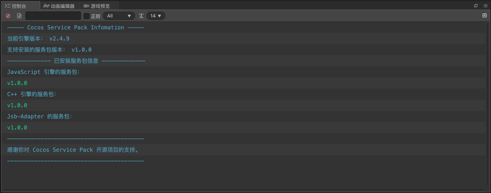

# 一键安装

我们提供了一个**付费扩展**，该扩展**唯一的作用即是帮助你一键安装和管理社区版的版本**。

它也作为对我们给予肯定和支持的**赞助通道**。

:::tip 声明

- **Enhance Kit 不是免费的开源项目吗？**

    再次重申 Enhance Kit 本身是**完全免费开源**的项目，该扩展**永远**只提供一键安装和版本管理的功能。
    
    也就是说，你可以选择 [手动安装](./installation-manual.md) 来使用，两者没有任何本质区别，也只需要几步即可完成。

:::

## 安装扩展

[点此跳转到商店页面](https://store.cocos.com/app/detail/3824) 下载并安装版本管理扩展。

## 一键安装

依次点击 Cocos Creator 的菜单栏 **扩展 - 增强包管理 - 安装增强包 - 安装最新版本**，会自动开始安装社区版。

:::caution 注意

- 社区版会增加一个名称为 `sp` 的 AssetBundle 以存放内置资源，**请确保你的项目未设置同名的 AssetBundle 引起冲突**。
- 没有必要将这个 Asset Bundle 设为远程包或者 Zip 压缩，里面只有几个着色器资源。

:::

:::note 扩展原理

扩展使用脚本帮您自动完成手动安装时需要做的步骤，比如设置自定义引擎和放置 TypeScript 类型提示文件。

:::

### 安装其它版本

依次点击 Cocos Creator 的菜单栏 **扩展 - 增强包管理 - 安装增强包 - 安装其它版本** 可以安装当前引擎支持安装的所有版本。

可以重复执行安装操作，扩展会自动进行覆盖。

## 检查安装状态

你可以运行项目并检查 Console 是否有打印类似 `Cocos Creator SP v2.4.x` 的日志，有的话则已经成功安装。

接下来推荐你继续阅读文档中剩下的内容以了解你能够使用的新特性！

## 查看信息

依次点击 Cocos Creator 的菜单栏 **扩展 - 增强包管理 - 查看信息**，会打印当前环境信息。

你可以看到当前引擎版本、支持一键安装的社区版版本和已安装的社区版版本等信息。
