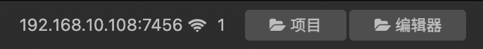

# 手动安装

## 下载并解压

前往 [Github Release](https://github.com/smallmain/cocos-enhance-kit/releases) 下载对应版本的压缩包。

**请确保您的项目的引擎版本与下载的社区版的引擎版本一致。**

:::tip 提示

建议升级到最新的引擎版本，官方只会对 2.x 版本只会进行维护性更新，所以不用担心其稳定性问题。

:::

解压压缩包后可以看到以下目录和文件：

- `engine`（JavaScript engine）
- `cocos2d-x`（Cocos2d-x engine）
- `jsb-adapter`（JSB adpater）
- `adapters`（Minigame adpaters）
- `extension`（支持性引擎扩展）
- `creator-sp.d.ts`（社区版类型文件）

## 替换自定义引擎

依次进入 Cocos Creator 菜单的 **项目 - 项目设置 - 自定义引擎**。

分别填写 **JavaScript 引擎路径**（对应 `engine` 目录）和 **Cocos2d-x 引擎路径**（对应 `cocos2d-x` 目录）。

然后点击 Cocos Creator 主界面右上角的 **编辑器** 按钮，进入到编辑器的资源目录。

接着使用压缩包内的 `jsb-adapter` 替换掉编辑器的 `Resources/builtin/jsb-adapter` 目录。

最后使用压缩包内的 `adapters` 替换掉编辑器的 `Resources/builtin/adapters` 目录。

## 安装支持性引擎扩展

按照官方的 [扩展安装](https://docs.cocos.com/creator/2.4/manual/zh/extension/install-and-share.html) 文档将压缩包内的 `extension` 目录放到项目的 `packages` 目录即可。

建议将 `extension` 目录重命名成一个更有意义的名字，比如 `enhance-kit`。

:::caution 注意

- 请勿将此引擎扩展与 [一键安装](./installation-auto) 中的付费引擎扩展混淆！
- 该扩展提供社区版运行所需的内置资源，是开源的一部分，**请勿同时安装两个引擎扩展，这会引起冲突**！
- 社区版会增加一个名称为 `sp` 的 AssetBundle 以存放内置资源，**请确保你的项目未设置同名的 AssetBundle 引起冲突**。
- 没有必要将这个 Asset Bundle 设为远程包或者 Zip 压缩，里面只有几个着色器资源。

:::

## TypeScript 类型提示（可选）

如果你的项目使用 TypeScript，可将压缩包内 `creator-sp.d.ts` 文件拷贝到项目根目录中以获取新的代码提示。

部分代码编辑器可能需要重启之后类型提示才会生效。

## 重启 Cocos Creator

完成以上的步骤后重启 Cocos Creator。

你可以运行项目并检查 Console 是否有打印类似 `Cocos Creator SP v2.4.x` 的日志，有的话则已经成功安装。

接下来推荐你继续阅读文档中剩下的内容以了解你能够使用的新特性！

如果编辑器输出了一条有关包体大小的警告，请阅读 [多线程支持](../user-guide/multithread/thread-intro#注意事项) 了解详情。
