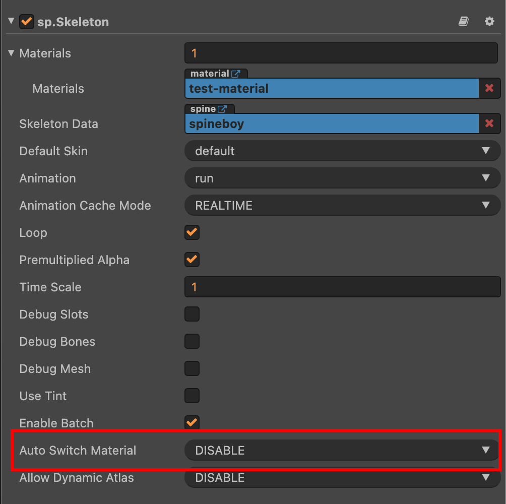

# 多纹理合批

使用 [多纹理材质](./multi-material.md) 文档中提到的 `MultiHandler` 的接口来动态设置材质的纹理插槽可能会比较麻烦，比如你需要使用一个纹理时，还得找到该纹理所在的材质并设置到渲染组件上。

为了能更方便地进行多纹理合批，社区版为组件增加了自动切换多纹理材质的机制，并且封装了一个多纹理合批管理类 `cc.sp.MultiBatcher`。

动态图集与字符图集使用的是全局多纹理合批管理器实例，可以通过 `cc.sp.multiBatcher` 访问。

## 开关自动切换多纹理材质

可以通过全局开关来控制所有组件的默认值：

```js
cc.sp.autoSwitchMaterial = false;
```

默认情况下组件会使用全局值，你可以控制单个组件是否强制启用/禁用该机制：



除了在编辑器调整，也可以通过代码控制：

```js
// cc.RenderComponent.EnableType
// GLOBAL: 全局默认值
// ENABLE: 开启
// DISABLE: 关闭
sprite.autoSwitchMaterial = cc.RenderComponent.EnableType.ENABLE;
```

:::caution 注意

组件有脏检查标记，如果修改全局开关或者修改纹理关联的材质，需要对所有使用该纹理的渲染组件调用 `comp.setVertsDirty()` 重新检查。

:::

:::caution 特别注意

如果 Spine 组件所使用的 `SkeletonData` 同时使用了多个纹理，那么只会遍历数据以找到的第一个纹理为主执行自动切换机制。

:::

## 设置纹理的关联材质

我们为纹理增加了一个关联材质的概念，在支持的组件内对纹理进行渲染时，会提前切换为该纹理关联的材质。

:::info

每个纹理只能关联一个材质，如果同一个纹理，不同的渲染组件需要使用不同材质就需要手动设置。

:::

关联材质的接口有两种用法：

```js
const bool = texture.linkMaterial(material);
const bool = texture.linkMaterial(material, index);
```

第一句代码会自动将纹理设置到材质的空插槽中，然后将该材质设置为该纹理的关联材质，如果没有空插槽会返回 `false`。

第二句则是强制将纹理设置到指定的插槽中，并将该材质设置为该纹理的关联材质。

想要解除两者的关联可以使用：

```js
texture.unlinkMaterial();
```

获取关联的材质可以使用：

```js
const material = texture.getLinkedMaterial();
```

## 多纹理合批管理器

手动关联材质就意味着你需要手动创建并管理创建的所有材质，如果是大量纹理需要关联材质就会比较麻烦。

所以我们封装了一个小巧的多纹理合批管理器 `cc.sp.MultiBatcher`。

这个管理器有点像动态合图管理器，它会持有一个材质数组，初始化后会使用内置的多纹理 Effect 着色器创建一个材质并放在数组中。

你可以传给管理器一个纹理，它会查找所有材质的空插槽，如果没有材质有空插槽则会创建一个新材质，然后把纹理与材质关联。

### 如何使用

创建管理器并初始化可以使用：

```js
const batcher = new cc.sp.MultiBatcher();
batcher.init();
```

传入纹理可以使用：

```js
const material = batcher.requsetMaterial(texture);
```

会返回关联的材质，如果纹理本来就已经有关联的材质，则会直接返回已关联的材质。

清空内部数组可以使用（这不会取消纹理的关联）：

```js
batcher.reset();
```
