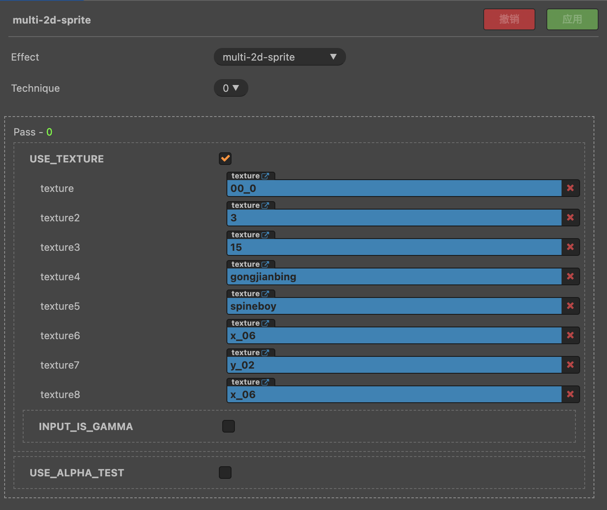
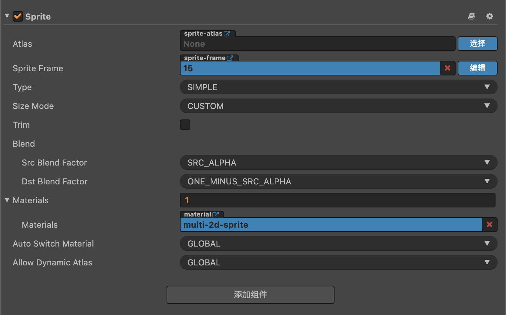

# 多纹理材质

服务包在引擎内置了可以直接使用的多纹理 Effect 着色器资源，并且你可以直接使用多纹理材质而不需要编写任何代码。

---
## 创建多纹理材质

你可以正常创建一个材质文件，Effect 选择内置的多纹理 Effect 着色器 `multi-2d-universal` 即可。



勾选 `USE_MULTI_TEXTURE` 后可以看到上面有 `texture` - `texture8` 一共 8 个纹理插槽，将需要使用的纹理拖到上面的插槽即可完成多纹理材质的配置。

---
## 在组件中使用多纹理材质

直接拖到组件的 `Materials` 属性上即可。



注意上图中已经在 `cc.Sprite` 组件拖入了刚刚创建的多纹理材质，并且其 `SpriteFrame` 属性设置的是材质中 `texture3` 插槽中的纹理。


你不需要指定组件要使用的纹理插槽 id，组件内部在渲染前会自动查找纹理在材质中的 id。

:::caution 警告

如果组件使用的纹理在材质中找不到，为了保证渲染的正常（毕竟性能只是锦上添花）会在组件的材质变体中将纹理设置到 `texture` 插槽中。

这会导致这个组件的多纹理材质变体之后都不能按预期进行合批，就像 “退化” 成了普通材质。

所以使用时必须要确保纹理在材质中，假如材质变体已经 “退化” 了，那你可以通过重新设置材质的方式使组件持有一个新的材质变体。

:::

:::caution 特别注意

Spine 组件使用多纹理材质时会强制勾选 `enableBatch`，因为不开启就不能合批，那也就没必要使用多纹理材质。

:::

---
## 自定义多纹理材质

上面介绍的多纹理材质都是使用的内置的多纹理 Effect 着色器，你可以直接在内置多纹理 Effect 着色器的基础上修改。

除了直接在内置着色器的基础上修改之外，任何着色器中如果存在一个宏 `USE_MULTI_TEXTURE = true`，则会被认为是多纹理材质。

[演示项目](https://smallmain.gitee.io/cocos-service-pack/demo/v1.0.0/web-desktop/index.html) 中有自定义材质的示范代码。

:::tip 提示

是否为多纹理材质的判断逻辑流程：

1. 获取材质当前使用的 Technique 中的第一个 Pass
2. 判断这个 Pass 是否 `USE_MULTI_TEXTURE = true`
3. 是的话，这个材质即为多纹理材质

在某些情况下通过代码修改材质可能需要调用 `material.updateMultiSupport()` 来触发这个流程。

:::

---
## 通过代码设置纹理插槽

每个多纹理材质都对应着一个多纹理材质管理器，这是服务包新增的一个工具类，其主要用处是便捷、高性能地管理多纹理材质上面的纹理插槽。

通过 `material.getMultiHandler()` 可以获取到管理器实例，请使用这个实例来操作多纹理材质的纹理插槽。

比如：

```js
// 获取管理器实例
const handler = material.getMultiHandler();

// 设置 `texture` 纹理插槽
handler.setTexture(0, texture);

// 置空 `texture2` 纹理插槽
handler.setTexture(1, null);

// 直接移除指定纹理
handler.removeTexture(texture.getImpl());

// 将纹理自动设置到材质的空插槽
handler.autoSetTexture(texture);
```

从上面的代码中可以看出操作纹理插槽的时候并不是传入插槽的名称，而是需要提供下标。

下标 `0` - `7` 分别对应着名称为 `texture` - `texture8` 的插槽。

可以使用这两个函数进行转换：

```js
// index to name
cc.sp.propertyIndex2Name(0);    // return: "texture"

// name to index
cc.sp.propertyName2Index("texture");    // return: 0
```

:::caution 注意

注意区分材质 `cc.Material` 与材质变体 `cc.MaterialVariant`。

:::

:::caution 警告

请勿直接通过材质原始的 `setProperty` 接口修改多纹理材质的纹理插槽。

如果你必须这么做，需要调用 `material.getMultiHandler().syncTextures()` 来同步插槽数据到 `MultiHandler` 上。

:::

---
## 强制设置材质的类型

如果你想将某个材质强制视为多纹理材质或非多纹理材质，可以：

```js
// 视为多纹理材质
material.setMultiSupport(true);

// 视为非多纹理材质
material.setMultiSupport(false);
```

没有特殊情况不需要这么做。
