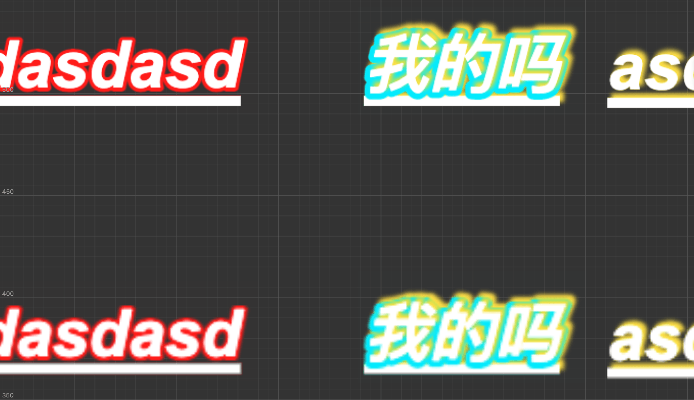

# 提升游戏质量

社区版加入了一些新特性，使得你能提升游戏各方面的质量。

## 高 DPI 文本渲染

以前我们会使用将 Label 字号放大一倍，Label 节点缩小一倍的方式去解决字体模糊的问题。

而现在不需要了，你可以通过一句代码调整渲染比例：

```js
cc.sp.labelRetinaScale = 2;     // 渲染文本时纹理的缩放倍数，默认值为 1.
```



> 图片中，上方的是开启后效果，下面是未开启效果。

**推荐你根据设备像素比（devicePixelRatio）来动态设置该值，并且该值不要大于 `2`，这不会带来更好的效果，但却将字体纹理放大了数倍，会影响到游戏整体性能。**

可前往 [高 DPI 支持](../user-guide/text-render/text-high-dpi.md) 文档了解更多详情。
