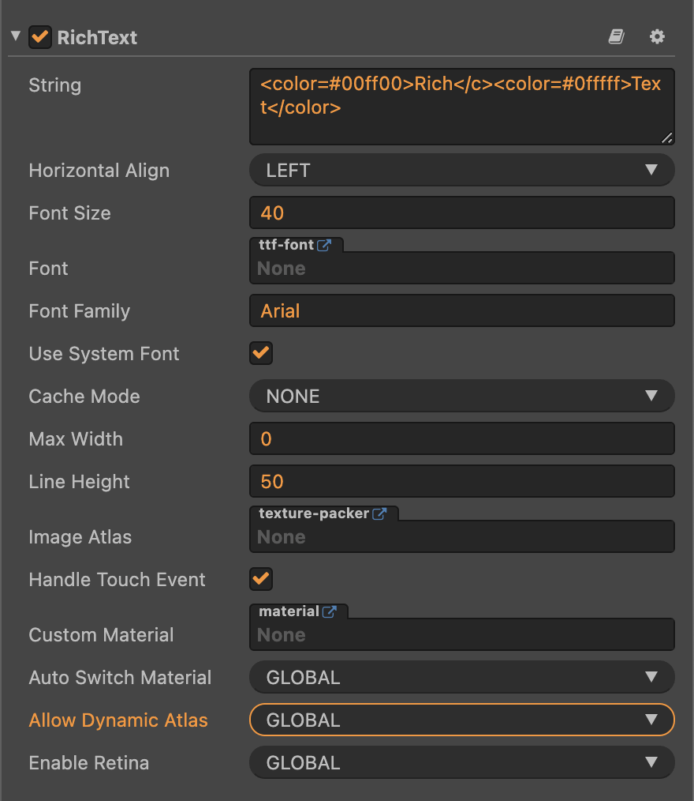

# 调整合图设置

---
## 动态图集最大数量为什么是 7

在前面的文档中有提到动态图集的最大数量默认为 **设备能同时采样纹理数 - Char 缓存模式自动合批图集数**。

因为设备能同时采样纹理数固定为 `8`，而 Char 缓存模式自动合批图集数默认为 `1`，所以动态合图的最大数量默认值为 `7`。

这样就只需要使用 1 个材质，也就是能在 1 Draw Call 里完成所有参与动态合图的纹理（包括 Bitmap 缓存模式 Label）与 Char 缓存模式 Label 的渲染。

一般情况下不推荐直接修改 `maxAtlasCount`，请参考 [Char 缓存模式](../text-render/text-char-mode.md#与动态图集合批的注意事项) 文档。

---
## 控制纹理是否参与动态合图

可以在编辑器上调整纹理的 `packable` 属性，或者用代码控制：

```js
texture.packable = false;
```

---
## 控制组件是否参与动态合图

使用下面的代码控制组件是否默认激活动态合图机制，默认为开启：

```js
cc.sp.allowDynamicAtlas = false;
```

也可以控制单组件是否激活动态合图机制：



除了在编辑器调整，也可以通过代码控制：

```js
// cc.RenderComponent.EnableType
// GLOBAL: 全局默认值
// ENABLE: 开启
// DISABLE: 关闭
label.allowDynamicAtlas = cc.RenderComponent.EnableType.ENABLE;
```

如果一个纹理参与动态合图但是组件不参与，那么使用该组件进行渲染时就不会参与，但如果同时在其它参与的组件上渲染，那么依然会被打入动态图集。

:::caution 注意

组件有脏检查标记，修改后可能需要对渲染组件调用 `comp.setVertsDirty()` 才会生效。

:::

---
## 是否自动多纹理合批

控制图集纹理是否会自动添加到多纹理合批管理器，默认为开启状态，如果关闭也就意味着**失去了自动进行多个图集纹理合批的特性**。

```js
cc.dynamicAtlasManager.autoMultiBatch = false;
```

---
## 在场景切换时清空所有图集

控制在场景切换时是否会清空所有的动态图集，默认为开启状态。

```js
cc.dynamicAtlasManager.autoResetBeforeSceneLoad = false;
```

:::tip 提示

在引擎原来的设计中，该机制不可被关闭，由于旧动态合图不支持复用废弃的空间，图集终究会被用完，所以引擎加入了这个治标不治本的功能。

但现在，我们认为该机制可以关闭，你只需要管理好纹理资源的释放即可，因为纹理资源释放的同时会释放使用的动态图集空间。

:::

---
## 不进行复用的区域空间大小

在实际的测试中，我们发现废弃空间出现碎片化的现象，比如尺寸 5 * 2 这样的非常小的废弃空间，当碎图尝试加入图集的时候会在这些废弃空间中寻找，这些数量多的小废弃空间无法被复用，却要在每次加入时遍历判断一次。

所以我们加入了 `ignoreRectSize` 设置，当废弃空间尺寸小于这个值就不会被遍历到（但是能合并为大的废弃空间时还是会合并），这能提升大约 50% 的理论性能。

这个值默认为 `10`，如果你的项目有很多小于 10 * 10 的纹理，可以考虑进行调整：

```js
cc.dynamicAtlasManager.Atlas.ignoreRectSize = 2;
```
