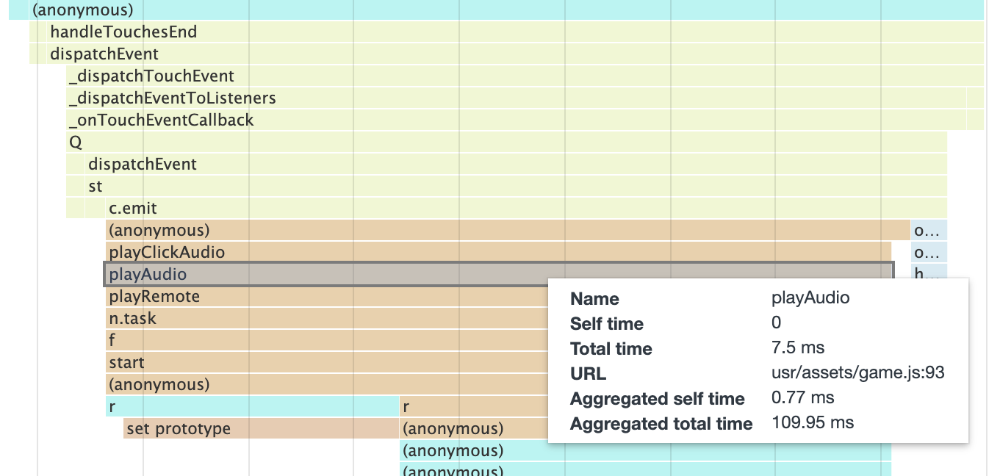
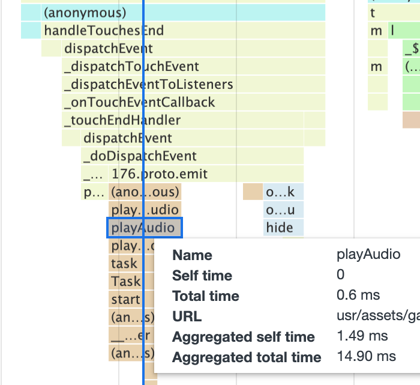

# 音频系统

依次点击编辑器的菜单项 **项目 - 社区版设置**，然后勾选 **多线程驱动音频系统**，即可启用这一特性。

启用后，针对音频的所有操作都会在 Worker 线程中执行，完全释放对主线程的占用。

下面是在 Android 设备上，在开启前对游戏帧耗时的分析图：

下面是开启多线程支持后：

可以看到每次播放音频的耗时从 7.5ms 降低至 0.6ms。

## 调整属性同步间隔

启用多线程支持后，音频实例运行在 Worker 线程中，所以音频属性是定时同步更新到主线程的。

默认情况下，间隔时间为 `500` 毫秒，其实大部分项目都不会读取音频属性，而是直接监听播放开始、播放结束等音频事件（无论如何，事件是立即发出的）。

所以我们可以适当地降低同步频率，优化项目的性能。

依次点击编辑器的菜单项 **项目 - 社区版设置**，然后修改 **属性同步间隔** 的值即可。

在启用音频系统的多线程支持后，会有一些接口差异，请前往 [破坏性变更](../../breaking-change#音频系统) 查看详情。
