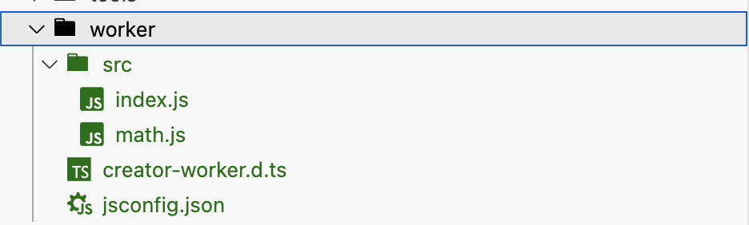

# 自定义多线程扩展

在之前，如果想为项目编写任何的多线程代码，因为 Worker 本身的易用性差，加上平台之间实现的差异，都会非常麻烦。

为此，社区版新增了自定义多线程扩展的支持，以简化多线程代码的编写，下面以计算斐波那契数列函数为例演示如何轻松编写多线程代码。

## 启用多线程扩展

依次点击编辑器的菜单项 **项目 - 社区版设置**，然后勾选 **项目多线程扩展** 即可。

## 创建多线程扩展

依次点击编辑器的菜单项 **扩展 - 创建新扩展插件... - 项目多线程扩展**。

这会在项目内的 worker 目录中以默认模板创建一个多线程扩展。



- `src` 多线程源码目录
  - `index.js` 入口脚本
  - `math.js` 含有 `add` 加法函数的示范脚本
- `creator-worker.d.ts` 提供代码类型提示
- `jsconfig.json` JavaScript 语言服务器配置

## 初识多线程架构

在编写多线程代码时，你需要时刻清楚**多线程扩展内的脚本会在 Worker 线程中执行**，所以不能直接导入项目内的脚本文件。

以下为 `math.js` 的内容，虽然只有几句代码，但这就已经是一个多线程函数的完整实现！

```js
const { registerHandler } = require("ipc-worker.js");

export function add(x, y, callback) {
    callback(x + y);
}

registerHandler("math", {
    add,
});
```

你已经可以在项目中直接调用这个函数：

```js
worker.math.add([1, 2], ([v]) => {
    console.log('Worker math add result:', v);
});
```

这个函数将在 Worker 线程内执行，而不会阻塞主线程。

让我们来编写一个在 Worker 线程中计算斐波那契数列的函数，来深入了解多线程代码的编写！

## 编写多线程脚本

### 创建脚本

我们先在 `src` 目录创建一个 `fibonacci.js` 脚本。

然后在 `index.js` 添加新的一行来导入它：

```js
require("fibonacci.js");
```

这样引擎在创建 Worker 时才会执行这个新脚本。

### 编写函数

在 `fibonacci.js` 脚本中实现计算斐波那契的函数：

```js
function _fibonacci(n) {
    if (n <= 0) return 0;
    if (n === 1) return 1;
    return fibonacci(n - 1) + fibonacci(n - 2);
}
```

### 导出函数到主线程

现在，虽然在 Worker 线程中我们有了这个函数，但是我们无法在主线程调用它。

与 Worker 线程的通信通常使用 `postMessage` 和 `onMessage` 进行，但是需要处理很多边缘情况，而且这样的开发体验也较差，所以社区版提供了一个封装。

我们需要导入 `registerHandler` 函数：

```js
const { registerHandler } = require("ipc-worker.js");
```

该函数的签名是：

```ts
export function registerHandler(name: string, handler: object): void;
```

调用函数时，函数会执行以下操作：

- 在全局变量 `worker` 的对象上增加一个与传入 `name` 一样的对象属性。
- 遍历传入 `handler` 对象上的所有属性，按规则在 `worker.<name>` 对象上创建对应的函数。

也就是说，我们只需要将 `fibonacci` 函数传入到 `registerHandler` 函数并调用，函数就可以在主线程中调用了！

以下是完整的 `fibonacci.js` 内容：

```js
const { registerHandler } = require("ipc-worker.js");

function _fibonacci(n) {
    if (n <= 0) return 0;
    if (n === 1) return 1;
    return fibonacci(n - 1) + fibonacci(n - 2);
}

function fibonacci(n, callback) {
    callback(_fibonacci(n));
}

registerHandler("utils", {
    fibonacci,
});
```

### 导出的内部原理

你可能注意到了我们导出的是另一个函数，而不是直接导出 `_fibonacci` 函数。

因为这是实现一个跨线程调用函数时需要遵循的规范：

- 与 `postMessage` 的要求一样，函数的所有参数必须是可序列化的。
- 当函数被调用时，会在函数最后一个参数传入一个回调函数，当需要返回到主线程时，请调用该函数。

像上面 `fibonacci` 函数的实现，在调用 `_fibonacci` 拿到计算结果后，通过调用 `callback(v)` 将值返回到主线程。

而在主线程中，我们需要像这样从主线程调用 Worker 线程中的这个函数：

```js
worker.utils.fibonacci([10], ([v]) => {
    console.log('Worker fibonacci result:', v);
});
```

你可能注意到了，第一个参数是数组，而第二个参数的回调的第一个参数也是数组，这也是规范。

为了提高跨线程通信的性能，减少垃圾回收的频率，所以选择了这种调用的方式。

你可以这样理解 `worker.xxx.xxx()` 的调用签名：

```
worker.utils.fibonacci(args, (values) => ...);

// utils: 要调用的 handler 名称
// fibonacci: 要调用 handler 中的 Worker 函数名称
// args: 传入到 Worker 函数的所有参数
// values: Worker 函数返回时的回调，参数是返回值数组
```

这很好理解，我们再举个多参数调用的例子：

```js
// Worker 线程的函数
function handle(a, b, c, callback) {
    // a = "ye.", b = {}, c = 1000
    callback(1, "text", { prop: 2 });
}

// 主线程的调用方式
worker.utils.handle(["ye.", {}, 1000], ([v1, v2, v3]) => {
    // v1 = 1, v2 = "text", v3 = { prop: 2 }
});
```

### 更多导出场景

无参数函数的实现与调用：

```js
// Worker 线程的函数
function setValue(callback) {
    // ...
    callback();
}

// 主线程的调用方式
worker.utils.setValue(() => {
    // ok.
});
```

无需返回的函数的实现与调用（这同时能节省 Worker 的通信开销，因为只需要单向通信！）：

```js
// Worker 线程的函数
function setValue(v) {
    // ...
    // 执行完成之后不调用 callback，甚至不用声明
}

// 主线程的调用方式
worker.utils.setValue(["ye."]);
```

无参数也无返回的函数的实现与调用（这同时能节省 Worker 的通信开销，因为只需要单向通信！）：

```js
// Worker 线程的函数
function setValue() {
    // ...
    // 执行完成之后不调用 callback，甚至不用声明
}

// 主线程的调用方式
worker.utils.setValue();
```

除了函数之外，你还可以导出值、getter/setter 属性，但需要注意需通过 `get_xxx`、`set_xxx` 和 `write_xxx` 三个代理函数进行访问与修改：

```js
// Worker 线程中：

registerHandler("Date", {
    time: 1,
});

// 主线程中：

// 获取值
worker.Date.get_time(([v]) => {
    // v is 1.
});

// 修改值，不会回调，性能比 write 更高
worker.Date.set_time([100]);

// 修改值，会回调以通知操作已执行完毕
worker.Date.write_time([100], () => {
    // finish.
});
```

## 编译多线程扩展

每次修改扩展代码之后，需要手动点击 **项目 - 重新编译多线程扩展** 以生效。

特别注意：**就像修改多线程的设置会影响到所有项目一样，多线程扩展的编译结果也是所有项目共用的！**

所以当你**构建某个项目之前，必须确保最后一次编译是当前项目的多线程扩展**！
