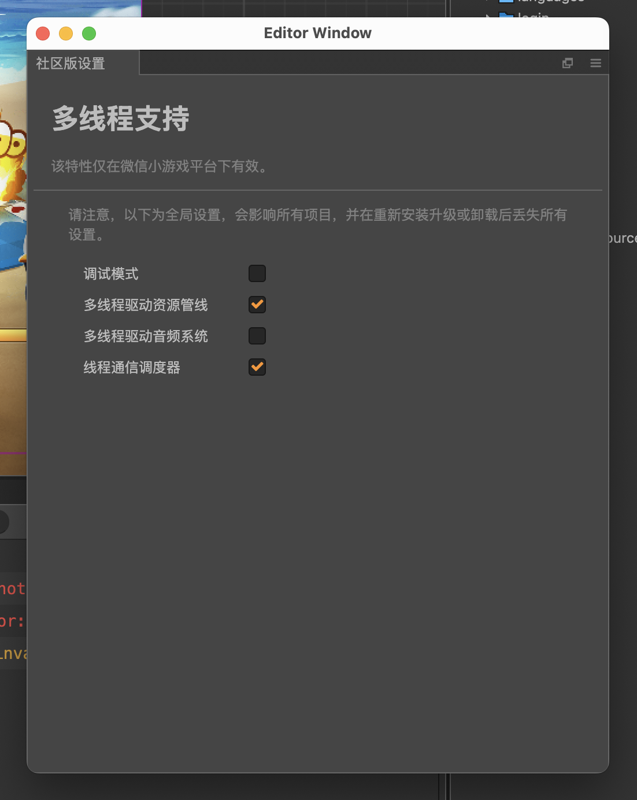

import DocCardList from '@theme/DocCardList';
import {useCurrentSidebarCategory} from '@docusaurus/theme-common';

# 多线程支持

:::caution 注意

本章节所有多线程特性暂时仅适用于微信小游戏平台。

并且在微信小游戏平台下还有以下改进：

- 默认启用网络接口和音频接口的高性能模式
- 网络接口支持 HTTP/2、HTTP/3(QUIC) 协议

:::

社区版为引擎的部分系统增加了多线程支持，启用后可以释放其对主线程的占用，减少卡顿现象。

你可以在社区版的设置面板启用多线程支持：



## 使用代码调整设置

你可以使用 [构建模板](https://docs.cocos.com/creator/2.4/manual/zh/publish/custom-project-build-template.html) 在 `game.js` 的 `__globalAdapter.init();` 语句执行之前声明宏来调整设置：

- CC_WORKER_ASSET_PIPELINE（是否启用 Worker 驱动资源管线）
- CC_WORKER_AUDIO_SYSTEM（是否启用 Worker 驱动音频系统）
- CC_WORKER_DEBUG（是否启用 Worker 调试模式）
- CC_CUSTOM_WORKER（是否启用自定义 Worker）
- CC_WORKER_AUDIO_SYSTEM_SYNC_INTERVAL（Worker 音频系统同步音频属性的间隔时间（单位：毫秒））
- CC_WORKER_WEBSOCKET（是否启用 Worker 驱动 WebSocket）
- CC_WORKER_HTTP_REQUEST（是否启用 Worker 驱动 HTTP 请求）

例如这样：

```js
// game.js
require('adapter-js-path');
// --- 在 init 执行之前设置 ---
globalThis.CC_WORKER_ASSET_PIPELINE = isAndroid;
// --------------------------
__globalAdapter.init();
```

当 `init` 执行之后，由于引擎已经初始化完毕，就不能再对设置进行修改了。

## 将 workers 代码目录设为子包

依次点击编辑器的菜单项 **项目 - 社区版设置**，然后勾选 **设为小游戏子包**，即可启用这一特性。

## 注意事项

当你重启编辑器，或者启用/禁用多线程支持时，可能出现以下几种情况：

**禁用多线程支持时输出的包体大小警告：**

由于要实现多线程支持，社区版在包体内增加了一个 `workers` 目录，用于存放 Worker 线程的代码。

大小有 `30-50KB` 左右，当你禁用多线程时，这个目录可以被删除以减少包体。

具体流程如下：

- 点击编辑器界面右上角的 **编辑器** 按钮，并跳转到 `Resources/builtin/adapters/platforms/wechat/res` 目录。
- 删除该目录下的 `workers` 目录。
- 打开该目录下的 `game.json`，删除 `workers` 字段并保存。

**启用多线程支持时输出的检测错误：**

这是由于你按照上面的步骤删除了多线程所需的文件和配置，所以无法启用多线程支持，只需恢复或者重新安装完整的社区版即可。

:::tip 注意

**如果你正在使用付费扩展，则无需手动删除或重新安装，也不会输出任何警告或者错误。**

因为付费扩展会存储已安装版本的备份文件，所以能够自动删除或重新安装。

如果付费扩展依然输出错误则可能是文件损坏，重新一键安装即可。

:::

阅读下面的文档了解详情：

<DocCardList items={useCurrentSidebarCategory().items}/>
