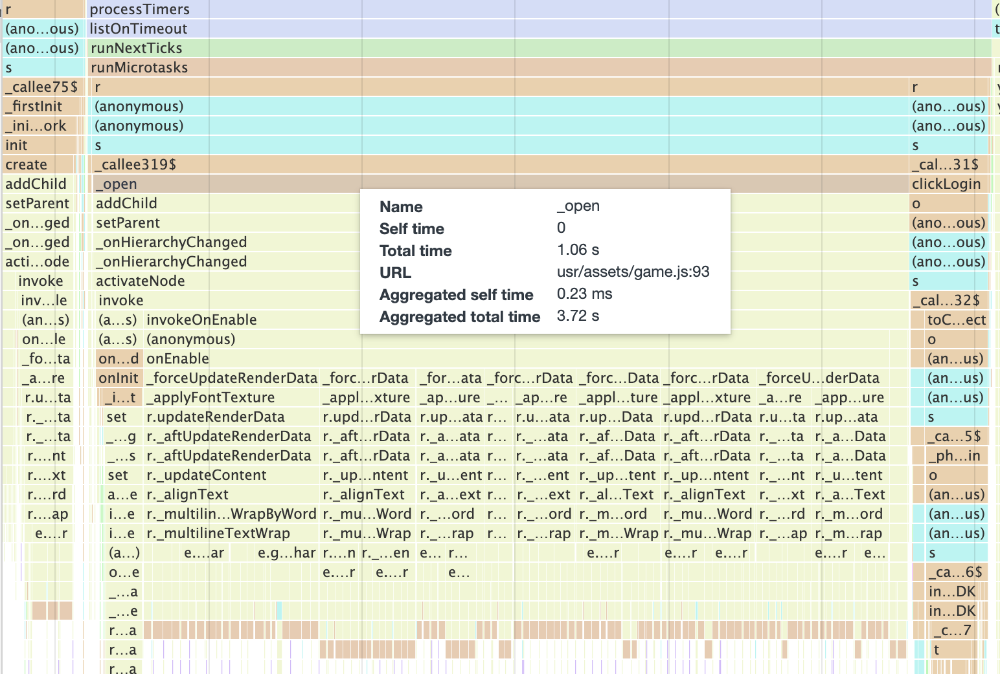
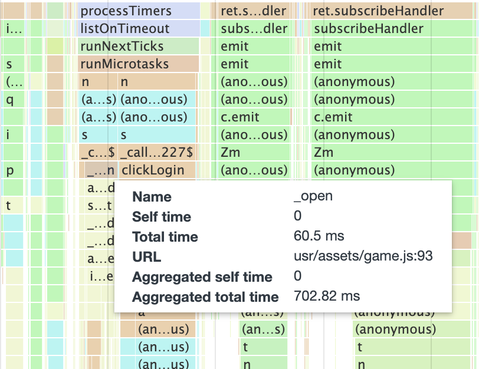

# 文本渲染烘焙

社区版为引擎增加了文本渲染烘焙的能力。

以某个项目的界面打开操作为例，通过分析 CPU Profile 可以看到，当界面节点激活时，绝大部分的耗时都来自于文本渲染函数（_applyFontTexture）。



但这个界面的文本量并不多，在低端机上的耗时却有 1.06s。

通过文本渲染烘焙优化后，耗时降至 60ms！



文本渲染烘焙分为三个部分：

- **预加载 Label Canvas**
- **烘焙文本测量值**
- **预加载 `Char` 图集**

我们将逐个说明。

## 预加载 Label Canvas

引擎通过离屏 Canvas 渲染文本，内部维护着一个 Canvas 池以作复用。

每个非 Char 模式的 Label 都会占用一个 Canvas 对象，直到 Label 销毁才会将 Canvas 对象放回池中。

默认情况下，Canvas 池不预先创建对象，而是在使用时进行创建，在部分低端设备上，这会增加文本渲染时的卡顿。

并且该 Canvas 池默认最大缓存数量为 32，超过该数量的对象不会放入池中而是直接销毁，这也导致大量使用 Label 的项目可能会因为持续创建 Canvas 而造成卡顿。

现在，社区版开放了这部分的接口，可通过 `cc.Label._canvasPool` 访问该对象池。

可以调整最大缓存数量：

```ts
cc.Label._canvasPool.max = 64;
```

可以预先缓存 Canvas 对象：

```ts
cc.Label._canvasPool.cache(Number.MAX_SAFE_INTEGER);
```

预先缓存接口需传入要缓存的对象数量，无论如何，实际缓存的对象数量都不会超过设置的最大数量。

## 烘焙文本测量值

引擎内部在渲染文本前需要先测量字符的宽高，这是通过 Canvas 上的 `measureText` 接口实现的。

如果你对性能进行了分析，那么可以看出，该接口占据单次文本渲染总耗时的 80% 以上。

引擎会对此接口的结果进行缓存，相同样式的文本会从缓存中读取，避免了部分性能消耗。

但默认情况下，该缓存仅会保留最后 100 次的测量值，也就是说，如果所有 Label 使用 Char 模式渲染，在渲染 100 个不同的字符后，缓存就会被逐个移除，测量值又会有大量性能消耗。

所以，社区版对这部分接口进行了优化，开放了 `cc.textUtils` 的部分接口来控制测量值缓存。

首先，你可以调整缓存容量，容量越大，就能避免更多测量值的性能消耗，但内存占用会上升，请视情况而定：

```ts
cc.textUtils.measureCache.limit = Number.MAX_SAFE_INTEGER;
```

其次，我们开放了操作缓存的接口，意味着你可以烘焙测量值，将测量值数据保存到项目中，完全避免测量值的性能消耗！

获取与应用缓存对象：

```ts
// 获取
const data = cc.textUtils.getMeasureCache();

// 应用
cc.textUtils.applyMeasureCache(data);
```

我们推荐的用法是：

- 在开发测试的版本中收集缓存数据并序列化到项目的 JSON 文件中（因为收集会有性能消耗，所以线上版本不进行收集）
- 在游戏启动前应用缓存数据

**注意**

经过我们的测试，同个字符在微信小游戏平台与 Web 端得出的测量值是一致的。

但可能会出现其它不同平台或者设备对同个字符的测量值是不一致的，建议针对这种情况烘焙多个 JSON 文件并分别应用即可。

## 预加载 `Char` 图集

建议先阅读 [烘焙文本测量值](#烘焙文本测量值)，再阅读本节内容。

如果你对性能进行了分析，那么可以看出，即使我们烘焙了文本测量值，依旧会有将文本绘制到纹理上的性能消耗，那么这剩下 20% 的性能消耗如果无法避免，能控制它消耗的时机也是很有意义的。

所以，社区版提供了 Char 图集的预加载接口，我们可以在特定时机（比如游戏启动时）就加载好会用到的所有字符，避免游戏中的卡顿。

引擎的 Char 图集只会在用到时才会创建，所以我们在调用任何接口前需要初始化：

```ts
cc.Label.LetterAtlases.init();
```

由于引擎并不会持有每个字符信息的缓存，所以需要通过社区版新增的开启缓存接口来保留字符信息：

```ts
cc.Label._shareAtlas.enableLetterCache = true;
```

和烘焙文本测量值一样，我们只推荐在开发测试版本收集缓存，因为保留缓存和收集操作都会有性能消耗。

以下两个接口可以获取与应用字符缓存：

```ts
// 获取
const data = cc.Label._shareAtlas.getLetterCache();

// 应用
cc.Label._shareAtlas.applyLetterCache(data);
```

需要注意的是，我们只是将渲染过的字符信息缓存下来，而不是纹理本身，然后在特定时机调用接口来批量渲染字符到纹理上。

并且，这里的缓存信息已经包括了每个字符的测量值，所以如果你的项目只使用 `CHAR` 模式的 Label 组件，那么你不用再单独烘焙文本测量值。

## 实际应用

你可以参考以下代码，在游戏开发测试版本中将缓存数据上传至一个后端服务器。

```ts
// 上报 Label 烘焙信息
if (!CC_EDITOR && game.TEST) {
    cc.director.once(cc.Director.EVENT_AFTER_SCENE_LAUNCH, () => {
        // 启用缓存
        cc.Label._shareAtlas.enableLetterCache = true;
        
        setInterval(() => {
            const unCaches = {};
            for (const key in cc.textUtils.measureCache.datas) {
                if (!(key in _measureCache)) {
                    unCaches[key] = cc.textUtils.measureCache.datas[key].value;
                    _measureCache[key] = unCaches[key];
                    console.warn("未收集的测量值：", key, unCaches[key]);
                }
            }

            if (Object.keys(unCaches).length > 0) {
                sendToServer(JSON.stringify(unCaches));
            }

            const unLetters = {};
            for (const key in cc.Label._shareAtlas.letterCache) {
                if (!(key in _letterCache)) {
                    unLetters[key] = cc.Label._shareAtlas.letterCache[key];
                    _letterCache[key] = unLetters[key];
                    console.warn("未收集的 Char 字符：", key, unLetters[key]);
                }
            }

            if (Object.keys(unLetters).length > 0) {
                sendToServer(JSON.stringify(unLetters));
            }
        }, 10000);
    });
}
```

然后在每个版本上线前，从后端下载缓存数据到项目中，并用代码读取并在游戏开始前应用：

```ts
cc.director.once(cc.Director.EVENT_AFTER_SCENE_LAUNCH, () => {
    // 提前缓存 Label Canvas
    cc.Label._canvasPool.cache(Number.MAX_SAFE_INTEGER);

    // 提高文本测量值缓存容量
    cc.textUtils.measureCache.limit = Number.MAX_SAFE_INTEGER;
    cc.textUtils.applyMeasureCache(_measureCache);

    // 烘焙 CHAR 字符
    cc.Label.LetterAtlases.init();
    cc.Label._shareAtlas.applyLetterCache(_letterCache);
});
```
